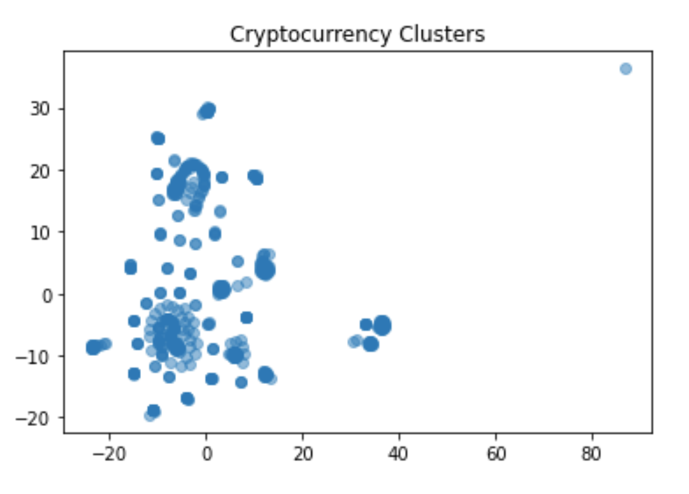

# Cryptocurrency Clusters

## Background

* To create a report that includes what cryptocurrencies are on the trading market and determine whether they can be grouped to create a classification system.

* To process the raw data to fit the machine learning models. Since there is no known classification system, used unsupervised learning to achieve this. Used several clustering algorithms to explore whether the cryptocurrencies can be grouped together with other similar cryptocurrencies. 

### Data Preparation

* Startted by reading `crypto_data.csv` into Pandas. The dataset was obtained from [CryptoCompare](https://min-api.cryptocompare.com/data/all/coinlist).

* Discarded all cryptocurrencies that are not being traded. In other words, filtered for currencies that are currently being traded. Once this was done, dropped the `IsTrading` column from the dataframe as it has no further use.

* Removed all rows that have at least one null value.

* Filtered for cryptocurrencies that have been mined. That is, the total coins mined should be greater than zero.

* In order for your dataset to be comprehensible to a machine learning algorithm, its data should be numeric. Since the coin names do not contribute to the analysis of the data, deleted the `CoinName` from the original dataframe.

* Next step in data preparation was to convert the remaining features with text values, `Algorithm` and `ProofType`, into numerical data. To accomplish this task, used Pandas to create dummy variables. 

* Standardized the dataset so that columns that contain larger values do not unduly influence the outcome.

### Dimensionality Reduction

* Creating dummy variables above dramatically increased the number of features in the dataset. Performed dimensionality reduction with PCA. Rather than specifying the number of principal components to instantiate the PCA model, it is possible to state the desired **explained variance**. For example, say that a dataset has 100 features. Using `PCA(n_components=0.99)` creates a model that will preserve approximately 99% of the explained variance, whether that means reducing the dataset to 80 principal components or 3. For this project, preserved 90% of the explained variance in dimensionality reduction by using `PCA(n_components=0.90)` 

* Next, further reduced the dataset dimensions with t-SNE and visually inspected the results. In order to accomplish this task, ran t-SNE on the principal components: the output of the PCA transformation from earlier. Then created a scatter plot of the t-SNE output to observe whether there are distinct clusters or not.

### Cluster Analysis with k-Means

* Created an elbow plot to identify the best number of clusters. Used a for-loop to determine the inertia for each `k` between 1 through 10. Determined, where the elbow of the plot was, and at which value of `k` it appeared.

### Recommendation

* Based on your findings, make a brief (1-2 sentences) recommendation to your clients. Can the cryptocurrencies be clustered together? If so, into how many clusters? 

- - -

## References

Crypto Coin Comparison Ltd. (2020) Coin market capitalization lists of crypto currencies and prices. Retrieved from [https://www.cryptocompare.com/coins/list/all/USD/1](https://www.cryptocompare.com/coins/list/all/USD/1)

- - -
